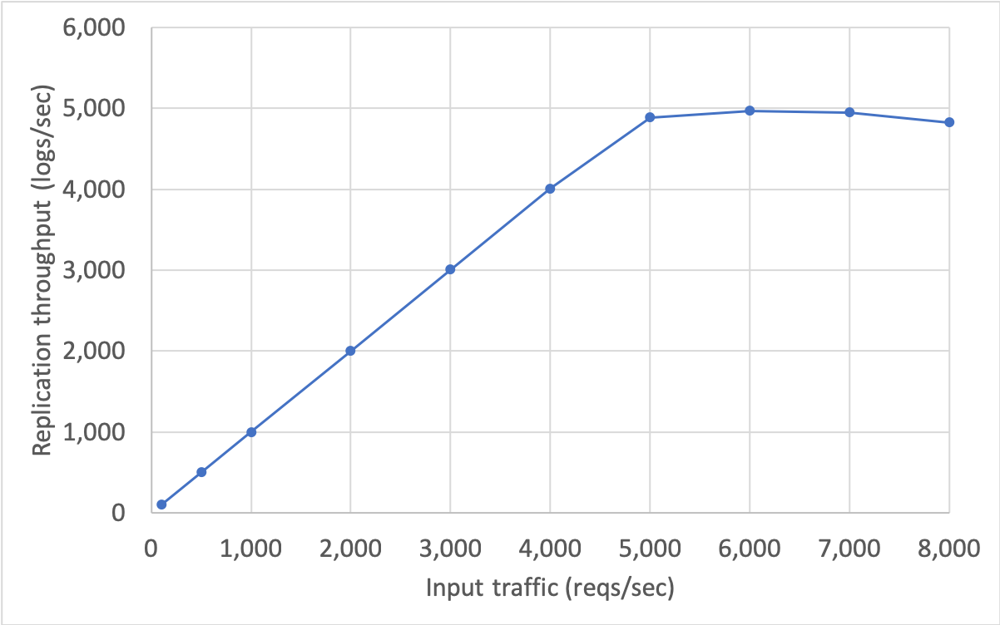
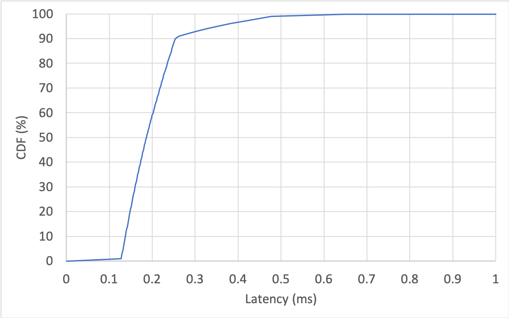
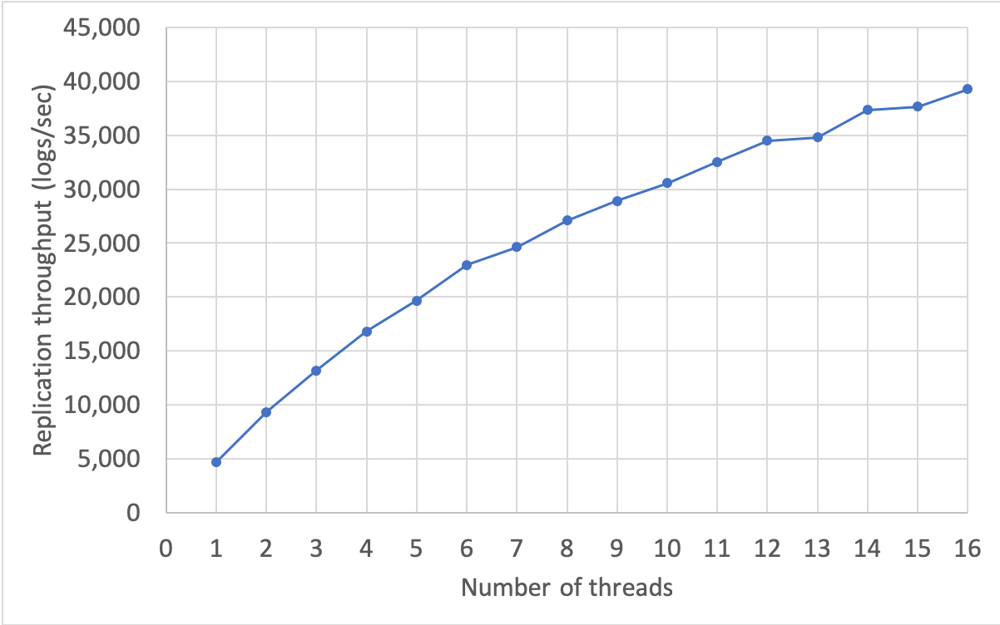
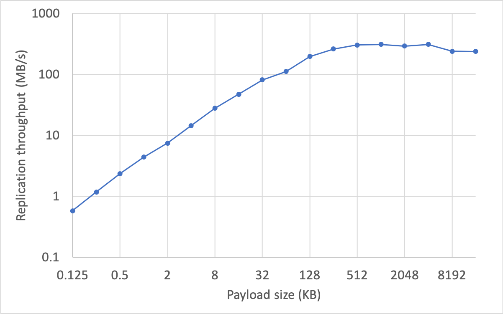

Quick Benchmark Results
===
(Measured on Mar 28, 2019)

Test Environment
-----
Used the same settings unless otherwise noted.

* 3 replicas: VMs in the same datacenter (8 cores, 16GB RAM).
    * Quorum write: commit a log when 2 out of 3 nodes agree on it.
    * Average network RTT: ~180 us
* No client batching.
    * A single request always corresponds to a single Raft log.
* Payload size: 256 bytes.
* [Benchmark program](../tests/bench)

Throughput
-----
* Throughput of a single client thread.
    * Send next request only after getting response of previous request.
* Replication throughput is saturated at roughly 5,000 ops/sec.

Latency
-----

| Percentile   | Latency (us) |
|--------------|--------------|
| 50%-tile     | 187          |
| 99%-tile     | 478          |
| 99.9%-tile   | 649          |
| 99.99%-tile  | 3746         |
| 99.999%-tile | 8192         |

Pipelining
-----
* Multiple threads are issuing replication requests on the same Raft group.
* It will be saturated by either network bandwidth or CPU capacity.

Payload Size
-----
* Single thread throughput, varying the payload size from 128 bytes to 16 MB.
* Overall throughput is saturated at 320 MB/s.

